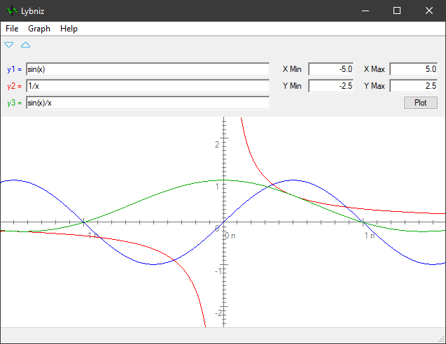

# Lybniz 3
Easy to use mathematical function graph plotter using Python on GTK  
Version 3, based on GTK+ 3.

Now also a [Windows Port](Tymber) based on the [Tymber](https://github.com/thomasfuhringer/tymber) Python module is available.

### Online version
<http://www.lybniz.com>

### Translations

You're welcome to translate: https://www.transifex.com/Magic/lybniz
